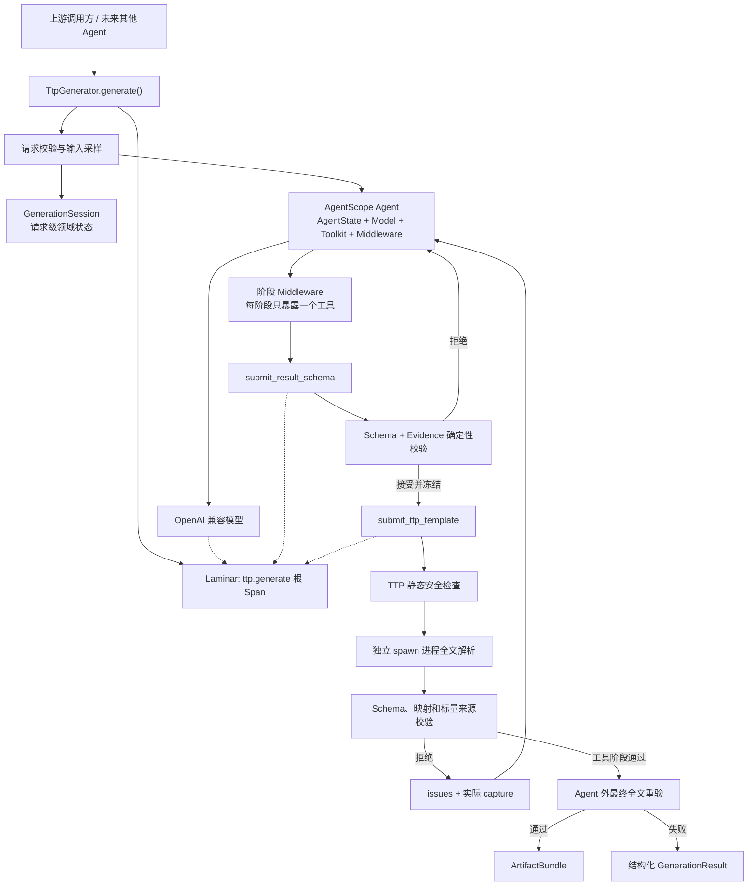

# 当前 Agent 架构与运行流程

<!-- markdownlint-disable MD013 -->

当前 Agent 本质上是一个“模型提出候选，确定性代码负责验收”的两阶段生成器。

输入不是命令本身，而是 `1–5` 份同一命令的实际输出。最终目标是生成：

- 一份共享的 TTP 模板；
- 一份描述单条解析结果的 JSON Schema；
- 与输入按索引一一对应的解析结果 `records`；
- 必要的推断说明 `assumptions`。

## 整体架构



代码采用 `ttp_generation` 垂直切片：

```text
src/cli_parser_agent/
├── config.py                    # 模型设置、执行和安全预算
├── observability.py             # Laminar 初始化与 Span 生命周期
└── ttp_generation/
    ├── contracts.py             # 公共请求、结果和错误契约
    ├── generator.py             # 顶层编排与最终验收
    ├── sampling.py              # 模型输入采样
    ├── agent/
    │   ├── builder.py           # 构建请求级 AgentScope Agent
    │   ├── middleware.py        # 当前阶段工具过滤
    │   ├── runner.py            # 事件循环、重试和中断
    │   ├── tools.py             # 两个提交工具与 GenerationSession
    │   └── prompt.py            # 中文提示词
    └── validation/
        ├── json_schema.py       # Schema、evidence、record 校验
        ├── ttp.py               # TTP 安全检查和隔离解析
        └── capture.py           # 有界的实际捕获反馈
```

## 关键设计

### 公共 API 与 AgentScope 解耦

对外只有异步 Python API：

```python
generator = TtpGenerator.from_env()

result = await generator.generate(
    GenerationRequest(command_outputs=[output_1, output_2]),
)
```

调用方看不到 AgentScope 的 `Msg`、Event 或 `AgentState`。这使未来的上游 Agent 可以像调用普通 Python 服务一样调用它。

公共入口见 [generator.py](../src/cli_parser_agent/ttp_generation/generator.py)，数据契约见 [contracts.py](../src/cli_parser_agent/ttp_generation/contracts.py)。

### 每次请求完全隔离

每个 `generate()` 都创建新的：

- `Agent`；
- `AgentState`；
- `Toolkit`；
- `GenerationSession`。

其中：

- `AgentState` 保存模型对话上下文；
- `GenerationSession` 保存冻结 Schema、候选模板、提交次数、校验问题等领域状态；
- 只有提交工具可以修改 `GenerationSession`；
- 模型普通文本永远不会被解析成产物。

Agent 构造位于 [builder.py](../src/cli_parser_agent/ttp_generation/agent/builder.py)，请求状态位于 [tools.py](../src/cli_parser_agent/ttp_generation/agent/tools.py)。

### 两阶段单工具状态机

第一阶段只允许：

```text
submit_result_schema
```

Schema 通过以下校验后永久冻结：

- 使用 Draft 2020-12；
- 根类型为 `object`；
- 使用 ASCII `snake_case` 字段；
- 所有对象必须完整声明 `required` 并设置 `additionalProperties: false`；
- 禁止 `$ref`、`oneOf`、`anyOf` 等复杂结构；
- 每个叶子字段必须有一条原文 evidence；
- evidence 必须确实存在于指定的完整输入中。

Schema 冻结后进入第二阶段，只允许：

```text
submit_ttp_template
```

Middleware 虽然在 Toolkit 中注册两个工具，但每次模型请求只保留当前阶段的一个工具，并且不强制 `tool_choice`。见 [middleware.py](../src/cli_parser_agent/ttp_generation/agent/middleware.py)。

### 模型不调用工具时的处理

模型可以思考，也可以返回普通文本，但普通文本不算提交。

如果一轮没有工具调用：

1. 回滚该轮新增的 Text、Thinking 和 usage；
2. 不记录或复述模型自由文本；
3. 加入固定中文提醒；
4. 在同一阶段重新请求模型。

Schema 与 TTP 阶段默认各允许重试 `3` 次。具体事件循环见 [runner.py](../src/cli_parser_agent/ttp_generation/agent/runner.py)。

## 一次请求的主要运行流程

### 第一步：请求校验

系统首先确认：

- 输入数量为 `1–5`；
- 每项非空；
- 每项 UTF-8 编码后不超过 `1 MiB`。

格式错误直接抛出 Pydantic 异常，不进入模型。

### 第二步：为模型准备采样输入

模型侧总字符预算默认 `240,000`。

过长输入按照完整行保留约：

- `75%` 头部；
- `25%` 尾部。

随后再根据最终 Prompt 长度和模型 token 预算继续收紧。

这里有一个重要区别：

- 模型看到采样文本；
- Schema evidence、TTP 校验和最终验收始终使用完整原文。

### 第三步：生成并冻结 Schema

模型调用 `submit_result_schema`，提交：

```text
result_schema
evidence
assumptions
```

无效时工具返回结构化 `issues`，模型继续修正。第一个通过的 Schema 会被深拷贝并永久冻结。

### 第四步：生成和修正 TTP

模型调用 `submit_ttp_template`。

每次候选都会依次经过：

1. XML/TTP 子语言白名单检查；
2. group、变量和参数 AST 检查；
3. 独立 `spawn` 进程执行 TTP；
4. 对全部完整输入执行 `parse(one=True)`；
5. 检查每份输入恰好产生一个根 `dict`；
6. 根据冻结 Schema 验证 records；
7. 检查所有标量能否追溯到原始输出。

隔离执行见 [ttp.py](../src/cli_parser_agent/ttp_generation/validation/ttp.py)。

### 第五步：把实际捕获结果反馈给模型

只要 TTP worker 成功运行，即使候选最终不合格，也会把真实解析结果返回模型：

```json
{
  "capture": {
    "available": true,
    "complete": true,
    "records": [{}, {"interfaces": []}]
  }
}
```

完整反馈最多 `32 KiB`；超限后转换为 JSON Pointer、容器大小和标量 head/tail preview。实现见 [capture.py](../src/cli_parser_agent/ttp_generation/validation/capture.py)。

这让模型能够看到“当前模板实际解析出了什么”，而不是只收到笼统的错误。

### 第六步：Agent 外最终验收

即使提交工具报告通过，也不能直接返回成功。

`generator` 会在 Agent 外重新执行：

- 冻结 Schema 与 evidence 校验；
- TTP 静态安全检查；
- 新的 spawn 进程全文解析；
- records 数量和顺序检查；
- Schema 验证；
- 标量来源检查。

最终 `ArtifactBundle.records` 使用这次重验的结果，而不是直接信任工具阶段缓存。

## 结果契约

成功时：

```text
GenerationResult
├── status = "success"
├── artifact
│   ├── ttp_template
│   ├── result_schema
│   ├── records
│   └── assumptions
├── issues
└── metadata
```

失败时：

```text
GenerationResult
├── status = "failed"
├── artifact = None
├── issues
├── metadata
└── last_attempt
    ├── ttp_template
    ├── result_schema
    └── validated = false
```

失败结果不会携带 partial records 或 capture。

## Laminar Trace

启用 Laminar 后，一次请求通常形成：

```text
ttp.generate
├── openai.chat
├── submit_result_schema
├── openai.chat
├── submit_result_schema
├── openai.chat
└── submit_ttp_template
```

其中：

- `ttp.generate` 是完整请求根 Span；
- `openai.chat` 来自 OpenAI 自动 instrumentation；
- 两个提交工具是手动 `TOOL` Span；
- TTP capture 位于工具 Span 输出中；
- `GenerationMetadata.laminar_trace_id` 用于定位运行；
- 如果未来由其他 Agent 调用，它可以继承上游 Trace，而不是另起一条 Trace。

实现位于 [observability.py](../src/cli_parser_agent/observability.py)。

## 默认预算

- 总时间：`300` 秒；
- 最多 `12` 个模型轮次；
- 最多 `8` 次 TTP 提交；
- 每次 TTP 解析最多 `20` 秒；
- Schema/TTP 阶段各最多 `3` 次零工具重试。

预算配置位于 [config.py](../src/cli_parser_agent/config.py)。

## 当前值得注意的运行特性

总时间目前属于协作式超时，不是进程强杀。底层模型请求取消和清理可能继续占用时间，因此实际墙钟耗时可能超过配置的总时间预算。

目前架构的安全和隔离边界相对完整。主要质量风险是模型能否稳定生成具有足够语义粒度的 Schema，并理解冻结 Schema 的 JSON 结构与 TTP group 实际结果之间的对应关系。确定性验收保证安全、结构一致和来源可追溯，但不等同于完整的业务语义正确性证明。
