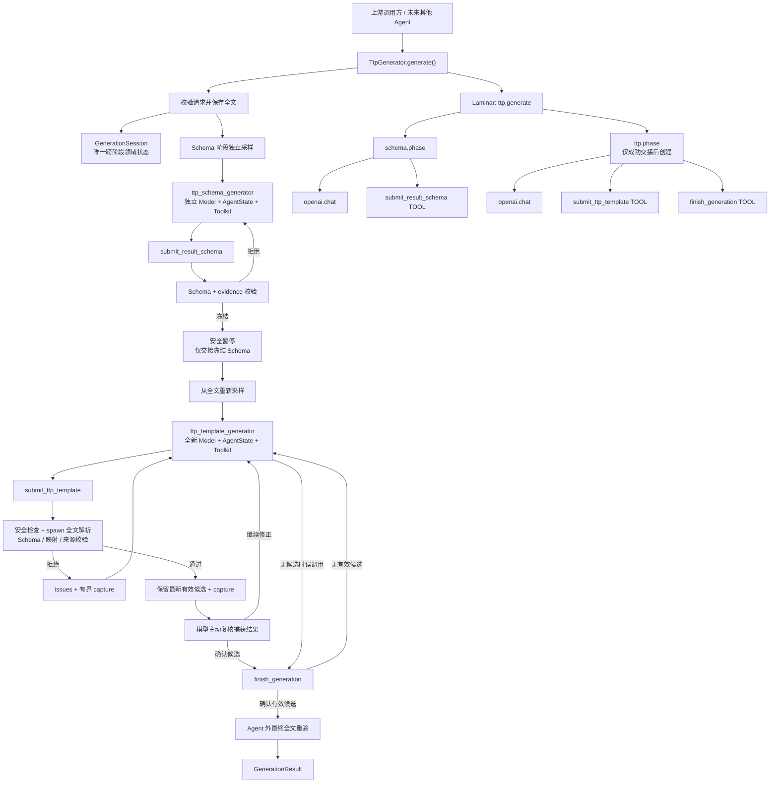

# 当前 Agent 架构与运行流程

<!-- markdownlint-disable MD013 -->

当前 Agent 是一个“模型提出候选、复核 capture 并显式完成，确定性代码负责验收”的两阶段生成器。输入是 `1-5` 份同一命令的实际输出，目标是生成一份共享 TTP 模板、一份描述单条解析结果的 JSON Schema、与输入一一对应的 `records`，以及必要的 `assumptions`。

本文用于理解运行过程。精确的公共契约、模块边界、默认限制和安全规则以 [首版架构](architecture.md) 为准。

## 整体架构



## 关键边界

### 公共入口与私有工作流

调用方只使用框架无关的异步 API：

```python
result = await TtpGenerator.from_env().generate(
    GenerationRequest(command_outputs=[output_1, output_2]),
)
```

[`generator.py`](../src/cli_parser_agent/ttp_generation/generator.py) 是公共门面，负责构造入口、请求检查和 `ttp.generate` 根 Trace；它把一次请求委托给私有 [`workflow.py`](../src/cli_parser_agent/ttp_generation/workflow.py)。workflow 显式编排 Schema 阶段、受控交接、TTP 阶段和最终验收。AgentScope 的 `Msg`、Event 与 `AgentState` 不进入公共结果。

### 三个数据范围

一次请求中的状态分为三个互不替代的范围：

- 阶段 `AgentState` 保存本阶段模型对话。Schema 和 TTP 使用完全不同的 Model、Agent、`AgentState` 与 Toolkit。
- [`GenerationSession`](../src/cli_parser_agent/ttp_generation/agent/session.py) 保存完整输入、冻结 Schema、最新有效 TTP 候选及其 records、提交计数和显式完成状态，是唯一跨阶段领域状态。
- Laminar Trace 可以只读观察两个阶段的完整过程，但 Trace 内容不会进入 handoff，也不会回灌模型上下文。

Schema Agent 的 rejected candidate、evidence、assumptions、issues、Thinking、ToolCall/ToolResult、零工具提醒和 usage 都不会进入 TTP `AgentState`。evidence 与 assumptions 仍留在 session 中，供最终验收和 artifact 使用。

### 阶段专属工具

两个 Toolkit 按阶段固定注册工具：

```text
Schema Agent -> submit_result_schema
TTP Agent    -> submit_ttp_template
             -> finish_generation
```

HTTP 请求省略 `tool_choice`，因此模型自主决定调用哪个当前阶段工具。普通 assistant 文本不被解析为产物。若一次模型调用没有工具调用，runner 回滚该回复新增的文本、Thinking 和 usage，再追加不引用回复内容的固定中文提醒；TTP 提醒要求模型在继续提交和确认 finish 之间选择。重试只发生在当前阶段，并继续消耗同一请求的全局轮次和 deadline。

## 一次请求的运行流程

### 1. 校验并建立请求状态

Pydantic 首先检查输入数量、空白内容和 UTF-8 字节上限。workflow 保存未经采样的完整输出，创建 `GenerationSession` 与共享 deadline。模型只读取后续阶段样本，工具校验和最终验收始终读取全文。

### 2. 为 Schema 阶段拟合输入

Schema 阶段从完整输出确定性采样，并按自己的系统提示、任务消息和唯一工具描述估算上下文。超限输入在完整行边界保留头部与尾部；若最小可用样本仍无法容纳，请求以带阶段信息的结构化上下文预算错误结束。

workflow 随后创建 `ttp_schema_generator`。其系统提示只讨论细粒度业务 Schema、字段 evidence 和 assumptions，不包含 TTP 提交协议或语法。

### 3. 提交、修正并冻结 Schema

Schema 模型调用 `submit_result_schema`，提交 Draft 2020-12 Schema、每个叶子字段的原文证据和 assumptions。工具在完整输入上检查元模式、安全子集、复杂度、封闭对象、字段名、required 集合和 evidence。

无效候选及其 issues 留在 Schema `AgentState` 中，模型可以继续修正。第一个通过校验的 Schema 被深拷贝并永久冻结；对应的 `ToolResultEndEvent` 是安全暂停点，runner 立即结束当前 reply。若 Schema 恰好耗尽了全局轮次，请求直接失败，不启动 TTP Agent。

### 4. 受控交接并重新采样

进入 TTP 阶段时，workflow 只从 session 读取冻结 Schema，并重新从完整输出执行 TTP 阶段采样和 token fitting。冻结 Schema 会计入该阶段的上下文预算。

随后创建全新的 `ttp_template_generator`、Model、`AgentState` 和双工具 Toolkit。它的首个 UserMsg 只包含 `<frozen_result_schema_json>` 和本阶段 `<command_outputs_json>`；两段 JSON 都可以无损还原。当前提示版本为 `ttp-generator-v10-explicit-finish-zh-cn`。

### 5. 生成和修正 TTP

TTP 模型调用 `submit_ttp_template`。每个候选先经过 TTP/XML 子语言白名单和参数 AST 检查，再在独立 `spawn` 进程中对所有完整输入执行解析。校验器要求每份输入恰好产生一个根 `dict`，逐个使用冻结 Schema 验证 record，并检查标量能否追溯到原始输出。模板通过这些检查时只保存为最新有效候选，不会结束 Agent。

只要 worker 成功运行，即使候选最终不合格，工具也会把实际捕获结果反馈给同一 TTP Agent：

```json
{
  "capture": {
    "available": true,
    "complete": true,
    "records": [{}, {"interfaces": []}]
  }
}
```

完整 capture 有固定大小上限；超限时转换为容器大小、JSON Pointer 标量和 head/tail preview。capture 与 issues 保留在 TTP 阶段的修正链中，不会写入失败的公共结果，也不会回传 Schema Agent。

模型必须复核每份输入的记录数量、异常空数组/空对象、表头或分隔线误捕获、字段是否为细粒度值，以及多样例结构是否一致。若不满意，它继续提交模板；后续无效提交不清除先前有效候选，新的有效提交会替换旧候选。若满意，它调用无参数的 `finish_generation`。没有有效候选时 finish 返回结构化拒绝，只有存在有效候选且 finish 成功时 TTP 阶段才结束。

每个模型回复最多调用一个工具；模型必须等提交 ToolResult/capture 进入后续上下文后再 finish。首版通过 `parallel_tool_calls=False` 和提示协议维持这个顺序，不额外记录候选产生轮次或实现同轮调用拦截。

默认最多提交 `9` 次模板。第 `9` 次候选仍会执行校验并返回 capture/issues，但随后请求无条件以 `ttp_submission_limit` 失败；因此最晚只能在第 `8` 次提交后调用 finish。轮次、时间或零工具预算在 finish 前耗尽时，即使 session 已保留有效候选也不会自动接受。

### 6. Agent 外最终验收

`finish_generation` 成功后，workflow 仍会在 Agent 外重新校验冻结 Schema 与 evidence，重新执行 TTP 安全检查和新的 spawn 全文解析，并复核 records 数量、索引映射、Schema 与标量来源。成功 artifact 使用这次重验得到的 records，而不是直接信任工具缓存；终验失败会直接返回结构化失败，不重新打开 TTP Agent。

失败结果保留结构化 issues 和可选的未验证 `last_attempt`，但不携带 partial records 或 capture。公共字段与 metadata 不变量见 [首版架构](architecture.md#4-公共契约)。

## Laminar Trace

显式启用 Laminar 后，一次成功交接的请求形成一棵端到端 Trace：

```text
ttp.generate
├── schema.phase
│   ├── openai.chat
│   └── submit_result_schema [TOOL]
└── ttp.phase
    ├── openai.chat
    ├── submit_ttp_template [TOOL]
    └── finish_generation [TOOL]
```

重试会在所属 phase 下增加 LLM 或 TOOL span。Schema 阶段失败时不会创建 `ttp.phase`。`openai.chat` 由 OpenAI instrumentation 记录，提交与完成工具使用手动 TOOL span；TTP capture 位于 `submit_ttp_template` 输出中，`finish_generation` 只记录空输入和接受/拒绝反馈。存在上游 Agent span 时，`ttp.generate` 继承该上下文而不是另起 Trace。

Trace 是调试视图，不是跨阶段数据总线。实现位于 [`observability.py`](../src/cli_parser_agent/observability.py)，精确的采集范围和生命周期规则见 [首版架构](architecture.md#24-可选-laminar-调试-trace)。

## 当前运行特性

默认共享预算是总时长 `360` 秒、两个阶段合计 `13` 个模型轮次和最多 `9` 次 TTP 提交；Schema/TTP 各自还有最多 `3` 次零工具重试，单次 TTP worker 解析默认限时 `20` 秒。

总时间限制是协作式超时，而不是进程强杀。底层模型请求的取消和清理可能继续占用时间，因此实际墙钟耗时可能超过配置值；TTP worker 的单次解析超时仍会终止独立子进程。

确定性验收保证安全、结构一致、全文执行和来源可追溯，但不等同于业务语义完整性的证明。当前主要质量风险仍是模型能否稳定生成足够细粒度的 Schema，并正确实现冻结 Schema 与 TTP group 结果之间的对应关系。
