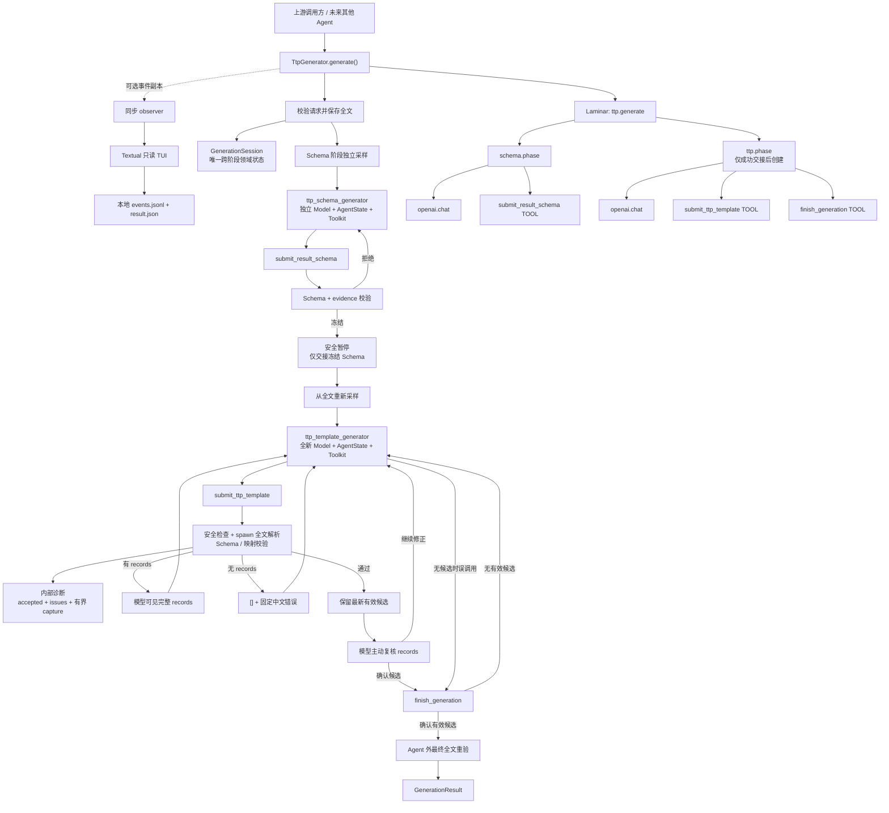

# 当前 Agent 架构与运行流程

<!-- markdownlint-disable MD013 -->

当前 Agent 是一个“模型提出候选、复核 records 并显式完成，确定性代码负责验收”的两阶段生成器。运行时仍兼容 `1-5` 份同一命令的实际输出；官方评测和 live corpus 每个 case 只提供一份 raw，目标是为该输入生成 TTP 模板、JSON Schema、单条 `records` 和必要的 `assumptions`。

本文用于理解运行过程。精确的公共契约、模块边界、默认限制和安全规则以 [首版架构](architecture.md) 为准。

## 整体架构


```mermaid
flowchart TD
    U["上游调用方 / 未来其他 Agent"] --> API["TtpGenerator.generate()"]
    API --> REQ["校验请求并保存全文"]
    API --> ROOT["Laminar: ttp.generate"]
    API -. "可选事件副本" .-> OBS["同步 observer"]
    OBS --> TUI["Textual 只读 TUI"]
    TUI --> LOCAL["本地 events.jsonl + result.json"]

    REQ --> SESSION["GenerationSession<br/>唯一跨阶段领域状态"]
    REQ --> SSAMPLE["Schema 阶段独立采样"]
    SSAMPLE --> SAGENT["ttp_schema_generator<br/>独立 Model + AgentState + Toolkit"]
    SAGENT --> STOOL["submit_result_schema"]
    STOOL --> SVALIDATE["Schema + evidence 校验"]
    SVALIDATE -->|拒绝| SAGENT
    SVALIDATE -->|冻结| HANDOFF["安全暂停<br/>仅交接冻结 Schema"]

    HANDOFF --> TSAMPLE["从全文重新采样"]
    TSAMPLE --> TAGENT["ttp_template_generator<br/>全新 Model + AgentState + Toolkit"]
    TAGENT --> TTOOL["submit_ttp_template"]
    TTOOL --> TVALIDATE["安全检查 + spawn 全文解析<br/>Schema / 映射校验"]
    TVALIDATE --> DIAGNOSTIC["内部诊断<br/>accepted + issues + 有界 capture"]
    TVALIDATE -->|有 records| MATCH["模型可见完整 records"]
    TVALIDATE -->|无 records| EMPTY["[] + 固定中文错误"]
    MATCH --> TAGENT
    EMPTY --> TAGENT
    TVALIDATE -->|通过| CANDIDATE["保留最新有效候选"]
    CANDIDATE --> REVIEW["模型主动复核 records"]
    REVIEW -->|继续修正| TAGENT
    REVIEW -->|确认候选| FTOOL["finish_generation"]
    TAGENT -->|无候选时误调用| FTOOL
    FTOOL -->|无有效候选| TAGENT
    FTOOL -->|确认有效候选| FINAL["Agent 外最终全文重验"]
    FINAL --> RESULT["GenerationResult"]

    ROOT --> SPHASE["schema.phase"]
    SPHASE --> SLLM["openai.chat"]
    SPHASE --> STOOLSPAN["submit_result_schema TOOL"]
    ROOT --> TPHASE["ttp.phase<br/>仅成功交接后创建"]
    TPHASE --> TLLM["openai.chat"]
    TPHASE --> TTOOLSPAN["submit_ttp_template TOOL"]
    TPHASE --> FTOOLSPAN["finish_generation TOOL"]
```

## 关键边界

### 公共入口与私有工作流

调用方只使用框架无关的异步 API：

```python
result = await TtpGenerator.from_env().generate(
    GenerationRequest(command_outputs=[output_1, output_2]),
)
```

[`generator.py`](../src/cli_parser_agent/ttp_generation/generator.py) 是公共门面，负责构造入口、请求检查和 `ttp.generate` 根 Trace；它把一次请求委托给私有 [`workflow.py`](../src/cli_parser_agent/ttp_generation/workflow.py)。workflow 显式编排 Schema 阶段、受控交接、TTP 阶段和最终验收。AgentScope 的 `Msg`、Event 与 `AgentState` 不进入公共结果。

需要完整调试时，可传入仅关键字 `observer`：

```python
result = await generator.generate(request, observer=event_queue.put_nowait)
```

observer 同步接收原始 AgentScope `AgentEvent` 和项目补充的 `CustomEvent`，但它只是只读事件副本，不是业务结果或控制接口。回调应只做非阻塞入队；首次异常会禁用本次 observer，而不会让 Agent 失败。

### 状态范围与只读观察面

一次请求中的状态与观察通道互不替代：

- 阶段 `AgentState` 保存本阶段模型对话。Schema 和 TTP 使用完全不同的 Model、Agent、`AgentState` 与 Toolkit。
- [`GenerationSession`](../src/cli_parser_agent/ttp_generation/agent/session.py) 保存完整输入、冻结 Schema、最新有效 TTP 候选及其 records、提交计数和显式完成状态，是唯一跨阶段领域状态。
- Laminar Trace 可以只读观察两个阶段的完整过程，但 Trace 内容不会进入 handoff，也不会回灌模型上下文。
- 可选 observer 接收同一次运行的流式事件和确定性进度事件。Textual TUI 可把它们保存为本地完整转录，但事件同样不会进入 session、handoff 或下一轮模型上下文。

Schema Agent 的 rejected candidate、evidence、assumptions、issues、Thinking、ToolCall/ToolResult、零工具提醒和 usage 都不会进入 TTP `AgentState`。evidence 与 assumptions 仍留在 session 中，供最终验收和 artifact 使用。

### 阶段专属工具

两个 Toolkit 按阶段固定注册工具：

```text
Schema Agent -> submit_result_schema
TTP Agent    -> submit_ttp_template
             -> finish_generation
```

HTTP 请求省略 `tool_choice`，因此模型自主决定调用哪个当前阶段工具。普通 assistant 文本不被解析为产物。若一次模型调用没有工具调用，runner 回滚该回复新增的文本、Thinking 和 usage，再追加不引用回复内容的固定中文提醒；TTP 提醒要求模型在继续提交和确认 finish 之间选择。重试只发生在当前阶段，并继续消耗同一请求的全局轮次和 deadline。

## 一次请求的运行流程

### 1. 校验并建立请求状态

Pydantic 首先检查输入数量、空白内容和 UTF-8 字节上限。workflow 保存未经采样的完整输出，创建 `GenerationSession` 与共享 deadline。模型只读取后续阶段样本，工具校验和最终验收始终读取全文。

### 2. 为 Schema 阶段拟合输入

Schema 阶段从完整输出确定性采样，并按自己的系统提示、任务消息和唯一工具描述估算上下文。超限输入在完整行边界保留头部与尾部；若最小可用样本仍无法容纳，请求以带阶段信息的结构化上下文预算错误结束。

workflow 随后创建 `ttp_schema_generator`。其系统提示只讨论细粒度业务 Schema、字段 evidence 和 assumptions，不包含 TTP 提交协议或语法。

### 3. 提交、修正并冻结 Schema

Schema 模型调用 `submit_result_schema`，提交 Draft 2020-12 Schema、每个叶子字段至少一条原文证据和 assumptions；同一路径可以包含多条证据并逐条验证。根 `$schema` 可以省略，显式提供时必须声明 Draft 2020-12，冻结和返回时不会自动补全。工具在完整输入上检查元模式、安全子集、复杂度、封闭对象、字段名、required 集合和 evidence。evidence 总数默认上限为 `256`，可由 `GenerationPolicy.max_schema_evidence` 或 `CLI_PARSER_MAX_SCHEMA_EVIDENCE` 向下收紧，但该资源上限不进入 Agent 工具协议。

无效候选及其 issues 留在 Schema `AgentState` 中，模型可以继续修正。第一个通过校验的 Schema 被深拷贝并永久冻结；对应的 `ToolResultEndEvent` 是安全暂停点，runner 立即结束当前 reply。若 Schema 恰好耗尽了全局轮次，请求直接失败，不启动 TTP Agent。

### 4. 受控交接并重新采样

进入 TTP 阶段时，workflow 只从 session 读取冻结 Schema，并重新从完整输出执行 TTP 阶段采样和 token fitting。冻结 Schema 会计入该阶段的上下文预算。

调用方也可以经公共 `generate_from_schema(TemplateRequest)` 直接提供结果 Schema。该模式跳过 Schema 阶段，把传入 Schema 通过受限子集校验后深拷贝冻结，随后从这一步开始执行完全相同的流程；Schema 未通过校验时以 `invalid_injected_schema` 失败且不启动 TTP Agent。由于手写 Schema 按定义没有逐叶子 evidence，最终验收在该模式改用不含 evidence 的 Schema 校验——evidence 的作用是把模型臆造的 Schema 锚定到原文，对人工指定的 Schema 不适用。TTP 白名单、spawn 隔离解析、records 回验和 Agent 外终验一律不变。该模式下 `schema_agent_rounds`、`schema_submissions` 与 `schema_sampled_char_count` 恒为 `0`，`agent_rounds` 等式仍然成立。

随后创建全新的 `ttp_template_generator`、Model、`AgentState` 和双工具 Toolkit。它的首个 UserMsg 只包含 `<frozen_result_schema_json>` 和本阶段 `<command_outputs_json>`；两段 JSON 都可以无损还原。当前提示版本为 `ttp-generator-v19-tool-arity-superseded-zh-cn`。对于标签存在但值为空且右侧有固定分隔符的字段，提示明确区分不能匹配空字符串的内置模式与允许零长度的受限 `re`，并要求行内空白问题不得通过改变 group 起止边界解决。

### 5. 生成和修正 TTP

TTP 模型调用 `submit_ttp_template`。每个候选先经过 TTP/XML 子语言白名单和参数 AST 检查，再在独立 `spawn` 进程中对所有完整输入执行解析。校验器要求每份输入恰好产生一个根 `dict`，并逐个使用冻结 Schema 验证 record；不再额外拒绝空字符串、空根对象或空容器。模型可见 ToolResult 直接是按输入索引排列的完整 records；没有 records 时追加固定中文错误。模板通过这些检查时只保存为最新有效候选，不会结束 Agent。

只要 worker 产生 records，即使候选最终未通过 Schema 校验，工具也会把实际解析结果直接反馈给同一 TTP Agent：

```json
[{}, {"interfaces": []}]
```

完整 records 受 `GenerationPolicy.max_parse_result_bytes` 约束，默认最高 `8 MiB`；超限沿用结构化模型失败路径。只有最近一次提交的 records 完整保留在模型上下文中：新的 `submit_ttp_template` 结果进入上下文后，更早的同名 ToolResult 正文会被替换为固定中文说明。被替换的只是已被后续提交取代的旧反馈，源 `<command_outputs_json>` 与当次完整 records 都不受影响；该说明不含 records、accepted、issues、预算或候选状态。这样可以阻断上下文无界增长（实测 input tokens 曾从 `3871` 增至 `92202`），同时保持"模型看到当次完整 records"的复核契约。内部 capture 仍有固定 `32 KiB` 上限，超限时转换为容器大小、JSON Pointer 标量和 head/tail preview。capture 与 issues 只保留在 Laminar、observer/TUI 和评测诊断链中，不会写入失败的公共结果，也不会回传 Schema Agent。

模型必须复核当前输入的记录数量、异常空数组/空对象、表头或分隔线误捕获以及字段是否为细粒度值。若不满意，它继续提交模板；后续无效提交不清除先前有效候选，新的有效提交会替换旧候选。若满意，它调用无参数的 `finish_generation`。没有有效候选时 finish 返回结构化拒绝，只有存在有效候选且 finish 成功时 TTP 阶段才结束。

每个模型回复最多调用一个工具；模型必须等提交 ToolResult/records 进入后续上下文后再 finish。首版通过 `parallel_tool_calls=False` 和提示协议维持这个顺序，不额外记录候选产生轮次或实现同轮调用拦截。

默认最多提交 `9` 次模板。达到有效 `max_ttp_submissions` 上限的候选仍会执行校验并向模型返回 records，但随后请求无条件以 `ttp_submission_limit` 失败；内部 capture/issues 仍进入诊断通道。默认上限为 `9`，因此默认最晚只能在第 `8` 次提交后调用 finish。轮次、时间或零工具预算在 finish 前耗尽时，即使 session 已保留有效候选也不会自动接受。

### 6. Agent 外最终验收

`finish_generation` 成功后，workflow 仍会在 Agent 外重新校验冻结 Schema 与 evidence，重新执行 TTP 安全检查和新的 spawn 全文解析，并复核 records 数量、索引映射与 Schema。当前不对转换后的标量做原文子串溯源；成功 artifact 使用这次重验得到的 records，而不是直接信任工具缓存；终验失败会直接返回结构化失败，不重新打开 TTP Agent。

失败结果保留结构化 issues 和可选的未验证 `last_attempt`，但不携带 partial records 或 capture。公共字段与 metadata 不变量见 [首版架构](architecture.md#4-公共契约)。

## Laminar Trace

显式启用 Laminar 后，一次成功交接的请求形成一棵端到端 Trace：

```text
ttp.generate
├── schema.phase
│   ├── openai.chat
│   └── submit_result_schema [TOOL]
└── ttp.phase
    ├── openai.chat
    ├── submit_ttp_template [TOOL]
    └── finish_generation [TOOL]
```

重试会在所属 phase 下增加 LLM 或 TOOL span。Schema 阶段失败时不会创建 `ttp.phase`。`openai.chat` 由 OpenAI instrumentation 记录，提交与完成工具使用手动 TOOL span；TTP capture 位于 `submit_ttp_template` 输出中，`finish_generation` 只记录空输入和接受/拒绝反馈。存在上游 Agent span 时，`ttp.generate` 继承该上下文而不是另起 Trace。

Trace 是调试视图，不是跨阶段数据总线。实现位于 [`observability.py`](../src/cli_parser_agent/observability.py)，精确的采集范围和生命周期规则见 [首版架构](architecture.md#24-可选-laminar-调试-trace)。

### Evaluation 外层

人工运行 `scripts/run_agent_evaluation.py` 时，Laminar 在上述树外再增加 `evaluation` 与 `executor` 两层。每个 repository `Datapoint` 对应一个 case 的一个 trial；executor 只把完整 raw outputs 传给一次公共 `generate()`，不传 observer，也看不到 expected target。生成结束后确定性 evaluator 才读取 target，执行严格 records/Schema 评分；随后只读 SQL 从同一 Trace 汇总 LLM/TOOL 调用、tokens、cost 和阶段时延。这个外层不改变 session、模型上下文、工具或 finish 协议。详细定义、安全边界和运行方式见 [Agent 黑盒评测](agent-evaluation.md)。

系统化评测把结果分成四组：records/Schema 严格正确性，Schema 冻结、TTP 进入、首个有效候选、finish 和最终验收的流程漏斗，`agent.round`/`context.fit`/`generation.deadline_cleanup`/`final.acceptance`/LLM/TOOL 的时延与 tokens/cost，以及按 case、suite、输入形状分层的重复 trial 可靠性。严格通过是最终门槛；叶子值和 Schema 的 precision/recall/F1、逐输入差异和 issue-code 只用于定位缺陷。评测报告同时提供按 case 的 macro 结果和按输入的 micro 结果，不能用多输入 case 的数量掩盖单输入失败。

需要完整修正链时，评测入口可以在独立进程中使用高预算配置：总时长 `7200` 秒、`32` 个 Agent 轮次、`24` 次 TTP 提交、单次模型超时 `120` 秒，并保持并发 `1`、不自动重试。高预算只用于开发诊断，不改变公共 API 或默认 `GenerationPolicy`；每次运行必须把有效模型、推理设置、预算和安全限制绑定到配置指纹，并保留对应 Trace。

HumanEvaluator 是评测入口的开发期人工补充：它可以在 Laminar 只读 Trace 中检查该 run 产生的全部 Schema/TTP 候选、capture 复核和最终候选，并按解析边界、字段粒度、可选字段、同一输入内实体一致性、过拟合和可维护性打标签。评审写入时显式区分 `phase=schema|ttp`，本地按阶段和 submission index 聚合覆盖率。HumanEvaluator 不属于 `TtpGenerator.generate()`、产品部署或普通 pytest，不修改 Agent 状态、不触发重试、不向模型回灌内容；本地摘要只保存有界标签、issue-code、Trace ID 和数值指标。

## 只读 Textual TUI

`scripts/run_agent_tui.py` 是单次真实运行的零参数开发入口。通过环境变量设置输入路径与运行配置后，在交互式终端中执行：

```powershell
uv run python scripts/run_agent_tui.py
```

TUI 为这次运行启用流式模型事件；所有界面操作都不改变脚本已配置的提示、阶段、工具、policy、候选和 finish 协议。顶部状态区显示阶段、耗时、轮次、提交次数、候选与终止状态；左侧时间线按顺序展示 Thinking、文本、工具调用/结果、Schema、TTP、capture 和验收事件，右侧显示选中块的可滚动详情。

- `Up` / `Down` 切换时间线块。
- `Space` 折叠或展开选中的 Thinking；当前流式 Thinking 默认展开，历史块默认折叠，手动选择优先。
- `PageUp` / `PageDown` 滚动详情；向上导航会暂停跟随，`End` 恢复跟随最新事件。
- 运行中 `Ctrl+C` 取消整个 generation task 并等待清理；完成后 `Enter` 退出。

完整事件顺序保存在 `.artifacts/agent-tui/<UTC-run-id>/events.jsonl`。`result.json` 保存脚本版本与状态、起止时间、模型、输入文件元数据、transcript 路径、可选 `GenerationResult` 和有界的 artifact/render/exception 类型。这些被 Git 忽略的本地文件是显式完整调试例外，可能包含原始输出、完整上下文、Thinking/文本、工具参数与结果、模板、capture 和验证反馈；模型/Laminar Key、credential/client 对象及未处理异常正文始终排除。界面只显示有界预览，artifact 保留完整事件；Laminar 可以同时启用，但不是 TUI 的事件来源。

该脚本要求 stdin 和 stdout 都是交互式 TTY。它不提供文件选择、模板编辑、人工重试、工具调用或生成控制，因此是只读开发观察器，不是产品 CLI。退出码为 `0` 成功、`1` 生成/界面/artifact 故障、`2` 配置或非 TTY、`130` 运行中取消。

## 当前运行特性

默认共享预算是总时长 `900` 秒、两个阶段合计 `13` 个模型轮次和最多 `9` 次 TTP 提交；Schema/TTP 各自还有最多 `3` 次零工具重试，单次 TTP worker 解析默认限时 `20` 秒。总时长默认值按实测单轮模型延迟（`100`-`374` 秒）取定，用于容纳 Schema 冻结、若干次 TTP 修正和一次 finish。高预算诊断只能通过开发评测入口显式覆盖这些值，不能把诊断配置当成产品默认或公共配置契约。

总时间限制是协作式超时，而不是进程强杀，但越界被两道机制约束。剩余时长不足以完成一次模型调用（阈值取 `model_timeout_seconds`）时不再开启新轮次，请求直接以 `generation_timeout` 结束；超时后的取消清理有固定宽限期并重复投递取消，宽限期内仍未停止的阶段任务会被放弃等待而不是无限期 await。这两点共同防止被取消的阶段在截止时间之后又发起一次完整模型请求。`model_timeout_seconds` 被设置到 connect/read/write/pool 各阶段，且 OpenAI SDK 自身重试被关闭，重试只由 AgentScope 记账一层。但它**不是单次调用的总时长上限**：httpx 没有 total-request 超时，`read` 只约束两次读取之间的间隔，因此持续流式返回的慢响应不会被它切断（实测 `120` 秒配置下出现过 `599` 秒的单次调用）。单次调用的实际兜底是上面两道预算机制，不是这个值。实际墙钟仍可能略超配置值；TTP worker 的单次解析超时仍会终止独立子进程。

确定性验收保证安全、结构一致、全文执行和 Schema 一致，但不判断 Schema 合法的空字符串、空根对象或空容器是否符合业务语义；该判断由模型结合完整 records 与原文完成。转换后的标量来源追踪暂未启用，后续方案记录在 `docs/ROADMAP.md`。当前主要质量风险仍是模型能否稳定生成足够细粒度的 Schema，并正确实现冻结 Schema 与 TTP group 结果之间的对应关系。
