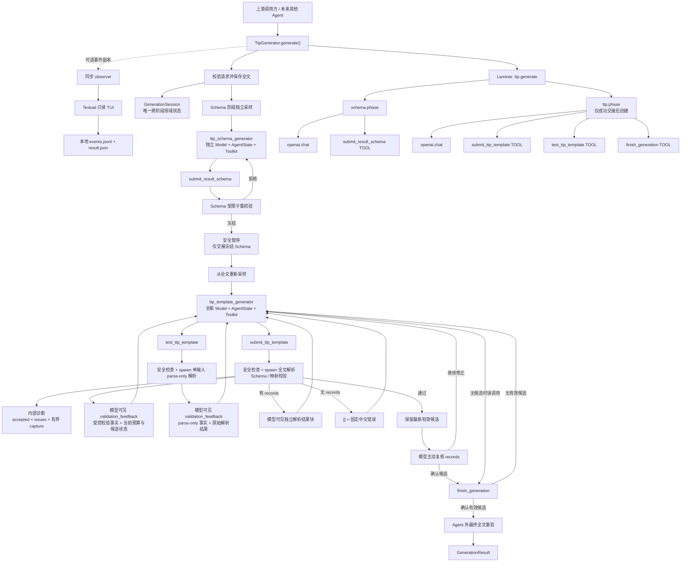

# 当前 Agent 架构与运行流程

<!-- markdownlint-disable MD013 -->

当前 Agent 是一个“模型提出候选、复核 records 并显式完成，确定性代码负责验收”的两阶段生成器。运行时仍兼容 `1-5` 份同一命令的实际输出；官方评测和 live corpus 每个 case 只提供一份 raw，目标是为该输入生成 TTP 模板、JSON Schema 和单条 `records`。

本文用于理解运行过程。精确的公共契约、模块边界、默认限制和安全规则以 [首版架构](architecture.md) 为准。

## 整体架构


```mermaid
flowchart TD
    U["上游调用方 / 未来其他 Agent"] --> API["TtpGenerator.generate()"]
    API --> REQ["校验请求并保存全文"]
    API --> ROOT["Laminar: ttp.generate"]
    API -. "可选事件副本" .-> OBS["同步 observer"]
    OBS --> TUI["Textual 只读 TUI"]
    TUI --> LOCAL["本地 events.jsonl + result.json"]

    REQ --> SESSION["GenerationSession<br/>唯一跨阶段领域状态"]
    REQ --> SSAMPLE["Schema 阶段独立采样"]
    SSAMPLE --> SAGENT["ttp_schema_generator<br/>独立 Model + AgentState + Toolkit"]
    SAGENT --> STOOL["submit_result_schema"]
    STOOL --> SVALIDATE["Schema 受限子集校验"]
    SVALIDATE -->|拒绝| SAGENT
    SVALIDATE -->|冻结| HANDOFF["安全暂停<br/>仅交接冻结 Schema"]

    HANDOFF --> TSAMPLE["从全文重新采样"]
    TSAMPLE --> TAGENT["ttp_template_generator<br/>全新 Model + AgentState + Toolkit"]
    TAGENT --> TTOOL["submit_ttp_template"]
    TAGENT --> XTOOL["test_ttp_template"]
    TTOOL --> TVALIDATE["安全检查 + spawn 全文解析<br/>Schema / 映射校验"]
    XTOOL --> XVALIDATE["安全检查 + spawn 单输入 parse-only 解析"]
    TVALIDATE --> DIAGNOSTIC["内部诊断<br/>accepted + issues + 有界 capture"]
    TVALIDATE --> FEEDBACK["模型可见 validation_feedback<br/>受控校验事实 + 当前预算与候选状态"]
    XVALIDATE --> XFEEDBACK["模型可见 validation_feedback<br/>parse-only 事实 + 原始解析结果"]
    FEEDBACK --> TAGENT
    XFEEDBACK --> TAGENT
    TVALIDATE -->|有 records| MATCH["模型可见独立解析结果块"]
    TVALIDATE -->|无 records| EMPTY["[] + 固定中文错误"]
    MATCH --> TAGENT
    EMPTY --> TAGENT
    TVALIDATE -->|通过| CANDIDATE["保留最新有效候选"]
    CANDIDATE --> REVIEW["模型主动复核 records"]
    REVIEW -->|继续修正| TAGENT
    REVIEW -->|确认候选| FTOOL["finish_generation"]
    TAGENT -->|无候选时误调用| FTOOL
    FTOOL -->|无有效候选| TAGENT
    FTOOL -->|确认有效候选| FINAL["Agent 外最终全文重验"]
    FINAL --> RESULT["GenerationResult"]

    ROOT --> SPHASE["schema.phase"]
    SPHASE --> SLLM["openai.chat"]
    SPHASE --> STOOLSPAN["submit_result_schema TOOL"]
    ROOT --> TPHASE["ttp.phase<br/>仅成功交接后创建"]
    TPHASE --> TLLM["openai.chat"]
    TPHASE --> TTOOLSPAN["submit_ttp_template TOOL"]
    TPHASE --> XTOOLSPAN["test_ttp_template TOOL"]
    TPHASE --> FTOOLSPAN["finish_generation TOOL"]
```

## 关键边界

### 公共入口与私有工作流

调用方只使用框架无关的异步 API：

```python
result = await TtpGenerator.from_env().generate(
    GenerationRequest(command_outputs=[output_1, output_2]),
)
```

[`generator.py`](../src/cli_parser_agent/ttp_generation/generator.py) 是公共门面，负责构造入口、请求检查和 `ttp.generate` 根 Trace；它把一次请求委托给私有 [`workflow.py`](../src/cli_parser_agent/ttp_generation/workflow.py)。workflow 显式编排 Schema 阶段、受控交接、TTP 阶段和最终验收。AgentScope 的 `Msg`、Event 与 `AgentState` 不进入公共结果。

需要完整调试时，可传入仅关键字 `observer`：

```python
result = await generator.generate(request, observer=event_queue.put_nowait)
```

observer 同步接收原始 AgentScope `AgentEvent` 和项目补充的 `CustomEvent`，但它只是只读事件副本，不是业务结果或控制接口。回调应只做非阻塞入队；首次异常会禁用本次 observer，而不会让 Agent 失败。

### 状态范围与只读观察面

一次请求中的状态与观察通道互不替代：

- 阶段 `AgentState` 保存本阶段模型对话。Schema 和 TTP 使用完全不同的 Model、Agent、`AgentState` 与 Toolkit。
- [`GenerationSession`](../src/cli_parser_agent/ttp_generation/agent/session.py) 保存完整输入、冻结 Schema、最新有效 TTP 候选及其 records、提交计数和显式完成状态，是唯一跨阶段领域状态。
- Laminar Trace 可以只读观察两个阶段的完整过程，但 Trace 内容不会进入 handoff，也不会回灌模型上下文。
- 可选 observer 接收同一次运行的流式事件和确定性进度事件。Textual TUI 可把它们保存为本地完整转录，但事件同样不会进入 session、handoff 或下一轮模型上下文。

Schema Agent 的 rejected candidate、issues、Thinking、ToolCall/ToolResult、零工具提醒和 usage 都不会进入 TTP `AgentState`。

两阶段默认使用的 `ObservedOpenAIChatModel.count_tokens` 在消息副本中排除
OpenAI formatter 不发送的 `ThinkingBlock`，其余内容和工具定义继续使用 AgentScope
原有 UTF-8 字节近似计数。这不是供应商 tokenizer，也不减少模型生成的推理 Token；
修正只避免未发送的历史 Thinking 提前触发压缩。真实历史、metadata、observer 和
Laminar 中的 Thinking 保持原样，初始拟合及原生压缩内部计数均使用同一修正实现。
压缩阈值、模型摘要、工具结果截断和项目提交历史折叠规则不变；真实可见内容达到
阈值时仍会压缩，摘要仍可能丢失初始输入或冻结 Schema。

### 阶段专属工具

两个 Toolkit 按阶段固定注册工具：

```text
Schema Agent -> submit_result_schema
TTP Agent    -> submit_ttp_template
             -> test_ttp_template
             -> finish_generation
```

HTTP 请求省略 `tool_choice`，因此模型自主决定调用哪个当前阶段工具。普通 assistant 文本不被解析为产物。若一次模型调用没有工具调用，runner 回滚该回复新增的文本、Thinking 和 usage，再追加不引用回复内容的固定中文提醒；TTP 提醒要求模型在继续提交、测试和确认 finish 之间选择。重试只发生在当前阶段，并继续消耗同一请求的全局轮次和 deadline。

## 一次请求的运行流程

### 1. 校验并建立请求状态

Pydantic 首先检查输入数量、空白内容和 UTF-8 字节上限。workflow 保存未经采样的完整输出，创建 `GenerationSession` 与共享 deadline。模型只读取后续阶段样本，工具校验和最终验收始终读取全文。

### 2. 为 Schema 阶段拟合输入

Schema 阶段从完整输出确定性采样，并按自己的系统提示、任务消息和唯一工具描述估算上下文。超限输入在完整行边界保留头部与尾部；若最小可用样本仍无法容纳，请求以带阶段信息的结构化上下文预算错误结束。

workflow 随后创建 `ttp_schema_generator`。其系统提示只讨论细粒度业务 Schema，不包含 TTP 提交协议或语法。

### 3. 提交、修正并冻结 Schema

Schema 模型调用 `submit_result_schema`，提交 Draft 2020-12 Schema。根 `$schema` 可以省略，显式提供时必须声明 Draft 2020-12，冻结和返回时不会自动补全。工具检查元模式、安全子集、复杂度、封闭对象、字段名和 required 集合。ASCII 小写 `snake_case` 属性名最长 120 字符，Python 保留关键字以 `schema.python_keyword_property_name` 拒绝；标量字段名 `ignore` 在这里以 `schema.reserved_scalar_field_name` 拒绝，object 和 array 容器名 `ignore` 仍允许。

无效候选及其 issues 留在 Schema `AgentState` 中，模型可以继续修正。第一个通过校验的 Schema 被深拷贝并永久冻结；对应的 `ToolResultEndEvent` 是安全暂停点，runner 立即结束当前 reply。若 Schema 恰好耗尽了全局轮次，请求直接失败，不启动 TTP Agent。

### 4. 受控交接并重新采样

进入 TTP 阶段时，workflow 只从 session 读取冻结 Schema，并重新从完整输出执行 TTP 阶段采样和 token fitting。冻结 Schema 会计入该阶段的上下文预算。

调用方也可以经公共 `propose_schema(GenerationRequest)` 只运行 Schema 阶段：它在 Schema 冻结后立即返回 `SchemaProposalResult`，不进入 TTP 阶段、不做最终验收，`ttp_agent_rounds` 与 `ttp_submissions` 恒为 `0`。返回的提案便于人工判断字段命名与粒度是否合适。由于成功的提案没有模板与 records，它无法满足 `ArtifactBundle`，因此使用独立结果契约而不是复用 `GenerationResult`。

把 `propose_schema` 与 `generate_from_schema` 串起来，就得到"先提案、人工确认或编辑、再按该 Schema 生成"的工作流；本地 WebUI 正是这样组合它们的。字段命名直接决定最终 records 的键名，这一步的人工介入可以消除模型自造命名带来的偏差。

调用方也可以经公共 `generate_from_schema(TemplateRequest)` 直接提供结果 Schema。该模式跳过 Schema 阶段，把传入 Schema 通过与模型提交相同的受限子集校验后深拷贝冻结，随后从这一步开始执行完全相同的流程；Schema 未通过校验时以 `invalid_injected_schema` 失败且不启动 TTP Agent。TTP 白名单、spawn 隔离解析、records 回验和 Agent 外终验一律不变。该模式下 `schema_agent_rounds`、`schema_submissions` 与 `schema_sampled_char_count` 恒为 `0`，`agent_rounds` 等式仍然成立。

随后创建全新的 `ttp_template_generator`、Model、`AgentState` 和三工具 Toolkit。它的首个 UserMsg 只包含 `<frozen_result_schema_json>` 和本阶段 `<command_outputs_json>`；两段 JSON 都可以无损还原。当前提示版本为 `ttp-generator-v44-schema-runtime-contract-zh-cn`。`test_ttp_template` 可用独立文本执行 parse-only 探索，不依赖冻结 Schema，也不改变候选、records、Schema 或提交计数。普通 TTP 变量头按词法规则识别，Python 关键字字段保持冻结名称；只有 `ignore(...)` 特殊调用继续使用受限 AST。对于标签存在但值为空且右侧有固定分隔符的字段，提示明确区分不能匹配空字符串的内置模式与允许零长度的受限 `re`，并要求行内空白问题不得通过改变 group 起止边界解决。

### 5. 生成和修正 TTP

TTP 提示要求对冻结 string 字段区分值槽缺失、字面空值和状态字符串：分别省略键、
捕获空 string 和保留原字符串。可选字段不能仅因值表示不可用而被排除；复核覆盖反馈时
仍须逐实例对照原文。通用 assets 示例用有明确逗号边界的值槽展示三者，不按符号外观
清洗业务值，也不改变合法类型转换、表头排除或确定性验收规则。

TTP 模型调用 `submit_ttp_template`。每个候选先经过 TTP/XML 子语言白名单和参数 AST 检查，再在独立 `spawn` 进程中对所有完整输入执行解析。校验器要求每份输入恰好产生一个根 `dict`，并逐个使用冻结 Schema 验证 record；不再额外拒绝空字符串、空根对象或空容器。

模型也可以调用 `test_ttp_template` 探索一份独立的非空文本和模板。它复用相同的白名单、spawn 隔离、超时和结果大小保护，但只返回单输入的原始 `parser.result(structure="list")` 形状，不执行 Schema 校验、根 object 要求或匿名根解包，也不保存候选。ToolResult 先返回 `scope=parse_only` 的结构化校验反馈；成功结果以一个 `parsed_record` 块返回，空数组也可以是成功解析结果；没有结果时追加 `[]` 和固定中文错误。测试结果历史全部保留，模型必须等待该 ToolResult 进入上下文后再继续提交或 finish。

判定根数量前有一步解包。TTP 会为未命名的顶层组多包一层 list：`<group>` 无 name 时，该输入的结果是 `[{...}]` 而不是 `{...}`。而当冻结 Schema 的根层同时含标量字段和 array 时，未命名最外层 group 是唯一正确写法——给它加 name 会把所有根层标量都嵌进那个名字底下。校验器因此先解包单元素外壳：外层 list 恰好一个元素且该元素是 `dict` 时解一层，其余形状原样交给根数量检查。真正的多根（同级两个命名组、或重复的未命名根组）会产出多元素 list，仍以 `ttp.multiple_root_objects` 被拒。模型可见 ToolResult 将按输入索引分别放入独立的 `<parsed_record>` 块；每个块同时带有 0-based `input_index` 和 1-based `display_number`，没有 records 时追加固定中文错误。模板通过这些检查时只保存为最新有效候选，不会结束 Agent。

只要 worker 产生 records，即使候选最终未通过 Schema 校验，工具也会把实际解析结果直接反馈给同一 TTP Agent：

```json
[{}, {"interfaces": []}]
```

完整结果块中的记录数据受 `GenerationPolicy.max_parse_result_bytes` 约束，默认最高 `8 MiB`；超限沿用结构化模型失败路径。结构化反馈的 `8 KiB` 上限不截断这些结果块。只有最近一次提交的反馈和结果块完整保留在模型上下文中：新的 `submit_ttp_template` 结果进入上下文后，更早的同名 ToolResult 正文会整体替换为固定说明“该次提交的匹配结果已被后续提交取代”。被替换的只是已被后续提交取代的旧反馈，源 `<command_outputs_json>` 与当次完整结果块都不受影响；该说明不含 records、accepted、issues、预算或候选状态。`test_ttp_template` 的实验反馈和结果不适用这条提交历史折叠规则，全部保留。这样可以阻断上下文无界增长（实测 input tokens 曾从 `3871` 增至 `92202`），同时保持"模型看到当次完整结果块"的复核契约。内部 capture 仍有固定 `32 KiB` 上限，超限时转换为容器大小、JSON Pointer 标量和 head/tail preview。capture 只保留在 Laminar、observer/TUI 和评测诊断链中，不会写入失败的公共结果；模型只接收当前校验 issues 的受控投影，不复制完整诊断或读取 Trace，任何 TTP 反馈都不会回传 Schema Agent。

模型先根据受控 issues 修正确定性错误，再复核当前输入的记录数量、异常空数组/空对象、表头或分隔线误捕获以及字段是否为细粒度值。`accepted=true` 不证明内容完整或忠实。若不满意，它继续提交完整模板；后续无效提交不清除先前有效候选，新的有效提交会替换旧候选。最新反馈的 `retained_candidate_submission_index` 从 session 读取，明确保留的是哪次提交，不能把它误认为本次提交通过。若满意，它调用无参数的 `finish_generation`。没有有效候选时 finish 返回结构化拒绝，只有存在有效候选且 finish 成功时 TTP 阶段才结束。

每个模型回复最多调用一个工具，且必须在三个 TTP 工具中恰好选择一个；模型必须等提交或测试 ToolResult 进入后续上下文后再继续提交或 finish。首版通过 `parallel_tool_calls=False` 和提示协议维持这个顺序，不额外记录候选产生轮次或实现同轮调用拦截。

默认最多提交 `9` 次模板。达到有效 `max_ttp_submissions` 上限的候选仍会执行校验并向模型返回 records，但随后请求无条件以 `ttp_submission_limit` 失败；内部 capture/issues 仍进入诊断通道。默认上限为 `9`，因此默认最晚只能在第 `8` 次提交后调用 finish。轮次、时间或零工具预算在 finish 前耗尽时，即使 session 已保留有效候选也不会自动接受。

#### 模型可见的结构化校验反馈

模板提交和独立测试在所有工具实现内的返回分支上，都先输出 `<validation_feedback>` JSON 块，再输出原有完整解析结果或 `[]` 与固定中文错误。参数拒绝、重复提交、预算耗尽、静态检查失败和 worker 异常遵守同一格式；AgentScope 在调用工具实现前拒绝的 malformed call 不经过该构造器。公共 API、工具入参、Schema 提交和 finish 的结构化反馈格式不变。

| 工具 | 字段 | 语义 |
| --- | --- | --- |
| 共用 | `feedback_version=1`、`scope`、`issues`、`issues_total`、`issues_omitted` | 版本、校验范围、受控问题及反馈省略数量；计数只针对工具收到的诊断，不声称穷尽所有错误 |
| `submit_ttp_template` | `scope=full_input_validation`、`accepted`、`expected_record_count`、`returned_record_count` | 本次完整输入与冻结 Schema 校验是否通过，以及预期与返回的 record 数量 |
| `submit_ttp_template` | `submissions_used`、`remaining_submissions`、`candidate_updated`、`retained_candidate_submission_index` | 提交计数、本次是否更新有效候选及当前保留候选的提交编号；没有候选时编号为 `null` |
| `test_ttp_template` | `scope=parse_only`、`parse_succeeded`、`tests_used`、`remaining_tests` | 仅说明独立实验解析是否成功及测试预算，不提供候选验收状态 |

提交编号从 1 开始。状态直接读取当前 session，本次拒绝不会抹掉已保留候选的编号。反馈不提供 `can_finish` 或 `next_action`：剩余局部预算不能保证总轮次和时间足够；最后一次允许提交即使 `accepted=true`，请求仍因提交预算耗尽而失败。

Agent 层的私有构造器与诊断 payload 分别生成模型消息。每条 issue 固定包含 `code`、`input_index`、`path`、`keyword` 和 `details`，按错误码与 keyword 白名单投影；不可用的输入索引、路径和 keyword 为 `null`，未知详情省略。路径中的数组索引保留为 `*`，例如 `/neighbors/*/med`，不提供具体数组元素定位。Schema 详情只包含缺失必填字段、额外属性数量、预期与实际类型；类型事实在 Schema 校验现场生成，遵循 JSON Schema 语义，区分布尔与数字并包含 `null`。模板诊断只投影受控异常类别、现有修正动作枚举和行列位置；模板路径只保留受控结构位置。

构造器不复制任意 `message`、`details`、异常正文、解析值或额外属性名称。字段名和 Schema 路径须来自冻结 Schema，字典形式的诊断执行相同校验；未知错误码映射为 `validation.unknown_issue`，未知异常类别映射为 `OtherError`。单个反馈 JSON 最多 `24` 条 issue、`8 KiB UTF-8`；required 详情的 `missing_required` 最多 `24` 个字段，并以 `missing_required_omitted` 记录省略字段数。按照上游跨输入交错顺序先保留顶层状态与计数，再加入完整 issue；不截断序列化后的 JSON，也不把该限额用于 records。

变量参数字符串中的裸 `|` 会被当前 TTP 错当作过滤器分隔符，导致 worker 异常或静默失效。
静态门禁在 worker 启动前返回 `ttp.incompatible_argument_pipe`，包含受控结构路径和
`required_action=split_pipe_argument`；可无歧义定位原始源码时提供从 1 开始的行列位置，
无法准确定位时省略。XML 解码后的字符串也检查。规则检查字符串源码中的字符，不自动
重写参数，不禁止正常的过滤器管道，也不把无裸字符的转义写法一律视为正则交替。
多个独立 `re` 或 `exclude` 调用须以实际匹配结果验证其语义。反馈仍遵守 24 条 issue、
8 KiB JSON 和完整 records 不截断的边界。

`submit_ttp_template` 还提供 `record_coverage`；这是反馈版本 1 的增量字段，不改变公共
API、工具入参或验收结果。无解析结果时为 `null`。存在 records 时，其字段如下：

| 字段 | 语义 |
| --- | --- |
| `required_paths_complete` | 输入到根 record 映射完整，且现有对象实例的所有 required 键存在；不证明类型、值、数组数量或 Schema 整体验收通过 |
| `optional_paths_absent` | 某个输入的现有父对象在该路径均没有对应可选键 |
| `optional_paths_partial` | 某个输入的现有父对象只有部分包含对应可选键 |
| `optional_paths_total`、`optional_paths_omitted` | 两类缺失事实的总项数和因条数或字节限额省略的项数 |

每条缺失事实只含 `input_index`、冻结 Schema 路径 `path`、`parent_occurrences` 和
`present_occurrences`。数组元素按 `*` 聚合；仅遍历实际存在且形状匹配的父容器，缺失可选
父对象不推导其子字段缺失，空数组也不虚构对象实例。显式存在的 `null` 算键存在，其类型
合法性仍由原 Schema issues 判定。字段来自本次解析结果，包括被拒绝的 records，不读取
保留候选的旧 records。parse-only 工具不计算或返回此字段。

两类列表跨全部输入合计最多 24 项，按输入交错；同一反馈 JSON 仍限 8 KiB。先保留顶层
状态、诊断和覆盖计数，再按现有顺序加入 issues，最后加入完整覆盖项；不截断 JSON 或
records。覆盖事实不判断源文本存在字段，也不把可选字段变成必填。模型必须对照原文：
有明确对应内容时修复捕获，确实没有时省略，不能用空字符串或 null 补造不存在的信息。

v34 提供可执行的合成示例：以真实早期标题启动未命名根组，使重复子数组与尾部标量
同属一个根对象；按真实缩进区分自由文本续行、后续字段和下一实体；逐层用真实标识行
重启重复章节；把有明确结构意义的标签与两侧装饰留在模板中，忠实保留值内部标点和换行。
根锚点是限定场景的起点，不是任意空控制行；模型不得机械照搬合成样例的标签或结构。
v35 澄清缩进续行示例的前提：同一 Entry 内所有匹配缩进行都属于 notes。Status 行本身
不会终止 notes 捕获，XML 匹配行顺序也不限定捕获区间；后面仍有同缩进非 notes 内容时，
必须另设经过解析验证的边界，不能直接套用该例。合成反例记录此解析行为，不改变解析规则。
v36 补充无自身字段、只含重复子组的容器起点示例：完整真实标题的 `ignore` 匹配启动
容器，不增加辅助字段。裸标题不构成匹配起点，子列表有结果不证明父级尾字段保留，
移动 XML 声明位置也不能替代起点；须复核有章节、无可选章节、再次有章节的重复实体
及各层尾字段。示例原样提取后通过隔离解析与 Schema 校验，单因素反例验证尾字段缺失。
v36 仅更新 TTP 提示，Schema 提示正文、解析规则和反馈协议不变。

v37 补充 string 状态值保真：标签、值槽或所属行不存在时省略键，明确空槽捕获
空字符串，已有状态或占位字符串保留原值。可选字段不代表可以丢弃已有内容；
只移除有结构证据的外部标签和装饰，不按外观清洗值内符号。合成示例同时验证
普通值、带符号状态、空槽和缺失行，反例说明 Schema 通过不能替代内容复核。

v38 明确冻结 string 的三类拼接约定：同一 token 的视觉折行使用空分隔符；
一个标签下纵向列举的名称或选项使用单个空格按顺序连接；有行界语义的自由文本
保留换行。对齐缩进和列表物理换行属于排版，词项内部空格、大小写和符号仍保留。
合成列表正例覆盖重复实体、可选列表缺失和尾字段；双向反例验证误选分隔符仍可
通过 Schema，因此字段覆盖和 accepted 不能替代表示方式复核。Schema 提示、
反馈协议、解析和严格评分规则保持不变。

相关诊断与真实回归结果见 [Broadcom 分隔符诊断](broadcom-v37-regression-diagnosis.md)、
[v37 Hard 回归](string-value-v37-regression.md) 和
[v38 Easy/Medium 回归](easy-medium-v38-regression.md)。

### 6. Agent 外最终验收

`finish_generation` 成功后，workflow 仍会在 Agent 外重新校验冻结 Schema，重新执行 TTP 安全检查和新的 spawn 全文解析，并复核 records 数量、索引映射与 Schema。成功 artifact 使用这次重验得到的 records，而不是直接信任工具缓存；终验失败会直接返回结构化失败，不重新打开 TTP Agent。

失败结果保留结构化 issues 和可选的未验证 `last_attempt`，但不携带 partial records 或 capture。公共字段与 metadata 不变量见 [首版架构](architecture.md#4-公共契约)。

`GenerationMetadata.ttp_test_calls` 记录测试预算内进入 `test_ttp_template` 实现后的调用次数，包括参数边界拒绝和 parse-only 失败；AgentScope 在工具实现前拒绝的 malformed call 不计入该字段。默认测试上限为 `3`，耗尽后的调用不再解析，单独增加 `ttp_test_calls_refused` 并返回预算拒绝反馈，不计入 `ttp_test_calls` 或 `ttp_submissions`，也不终止整个请求。模型反馈的 `tests_used` 与 `remaining_tests` 从这些当前 session 状态生成。`propose_schema` 未进入 TTP 阶段时测试计数恒为 `0`。

## Laminar Trace

显式启用 Laminar 后，一次成功交接的请求形成一棵端到端 Trace：

```text
ttp.generate
├── schema.phase
│   ├── openai.chat
│   └── submit_result_schema [TOOL]
└── ttp.phase
    ├── openai.chat
    ├── submit_ttp_template [TOOL]
    ├── test_ttp_template [TOOL]
    └── finish_generation [TOOL]
```

重试会在所属 phase 下增加 LLM 或 TOOL span。Schema 阶段失败时不会创建 `ttp.phase`。`openai.chat` 由 OpenAI instrumentation 记录，提交、测试与完成工具使用手动 TOOL span；TTP capture 位于 `submit_ttp_template` 诊断输出中，`test_ttp_template` 的独立解析结果和调用次数也进入诊断。模型反馈在工具内从当前确定性事实独立构造，不读取这些 span。`finish_generation` 只记录空输入和接受/拒绝反馈。存在上游 Agent span 时，`ttp.generate` 继承该上下文而不是另起 Trace。

Trace 是调试视图，不是跨阶段数据总线。实现位于 [`observability.py`](../src/cli_parser_agent/observability.py)，精确的采集范围和生命周期规则见 [首版架构](architecture.md#24-可选-laminar-调试-trace)。

### Evaluation 外层

标准测试集运行由 `scripts/run_test_sets.py` 负责。默认范围只选择 TOML 明确登记的 `default_input` 及同索引 expected record，`--input-scope full` 才运行全部输入；`baseline` 只在本地隔离执行选中输入的标准 TTP 模板，`ttp-only` 对每个 trial 只调用一次公共 `generate_from_schema()`，再由 Agent 外确定性验收和比较 expected records。该开发入口不创建 Laminar Evaluation，Laminar 仅作为可选 Trace 通道；详细格式和运行方式见 [四件套评测](ttp-template-evaluation.md)。

系统化评测把结果分成四组：records/Schema 严格正确性，Schema 冻结、TTP 进入、首个有效候选、finish 和最终验收的流程漏斗，`agent.round`/`context.fit`/`generation.deadline_cleanup`/`final.acceptance`/LLM/TOOL 的时延与 tokens/cost，以及按 case、suite、输入形状分层的重复 trial 可靠性。严格通过是最终门槛；叶子值和 Schema 的 precision/recall/F1、逐输入差异和 issue-code 只用于定位缺陷。评测报告同时提供按 case 的 macro 结果和按输入的 micro 结果，不能用多输入 case 的数量掩盖单输入失败。

需要完整修正链时，评测入口可以在独立进程中使用高预算配置：总时长 `7200` 秒、`32` 个 Agent 轮次、`24` 次 TTP 提交、单次模型超时 `120` 秒，并保持并发 `1`、不自动重试。高预算只用于开发诊断，不改变公共 API 或默认 `GenerationPolicy`；每次运行必须记录有效模型、推理设置、预算和安全限制的脱敏配置，并保留对应 Trace。

HumanEvaluator 是评测入口的开发期人工补充：它可以在 Laminar 只读 Trace 中检查该 run 产生的全部 Schema/TTP 候选、capture 复核和最终候选，并按解析边界、字段粒度、可选字段、同一输入内实体一致性、过拟合和可维护性打标签。评审写入时显式区分 `phase=schema|ttp`，本地按阶段和 submission index 聚合覆盖率。HumanEvaluator 不属于 `TtpGenerator.generate()`、产品部署或普通 pytest，不修改 Agent 状态、不触发重试、不向模型回灌内容；本地摘要只保存有界标签、issue-code、Trace ID 和数值指标。

## 本地 WebUI

`scripts/run_webui.py` 是零参数的本地界面入口，只绑回环地址：

```powershell
uv run --env-file .env python scripts/run_webui.py
```

它提供两条路径：**完整生成**等价于命令行的两阶段流程；**先提案 Schema** 则调用 `propose_schema()`，把冻结提案写入运行目录供人工复核编辑，确认后再经 `generate_from_schema()` 生成模板。编辑后的 Schema 在保存前必须通过受限子集校验，未通过时回显 issue 且不覆盖已存文件。

同一时刻只允许一次生成在跑，冲突返回 `409`；生成在后台任务中执行，HTTP 请求立即返回。WebUI 进程默认将自己的模型设置覆盖为 `stream=True`，可用 `CLI_PARSER_WEBUI_STREAM=false` 为不支持流式的供应商降级；公共生成器默认值不变。进度经 SSE 推送带本地 sequence 的 Agent 时间线，包含经安全投影的 Thinking、模型文本、工具参数、工具结果、阶段和重试事件，支持 `Last-Event-ID` 重放。运行记录以纯文件保存在被 Git 忽略的 `data/runs/<UTC 时间戳>/`，列表即目录扫描。

SSE 帧统一使用默认 `message` 事件，客户端按 JSON 正文中的 `type` 分发；详情接口加载历史事件后可用 `after_sequence` 避免重复，浏览器自动重连继续使用 `Last-Event-ID`。同一 block 或 tool call 的连续 delta 在服务端按 50ms 或 4096 字符合并，再分配 sequence、写入 `events.jsonl` 并广播。合并不会丢失正常流量的文本内容，但不承诺保留供应商逐 token 边界。

WebUI 的 HTTP 层和 `RunManager` 只依赖 `GenerationService` 服务协议；`agent_service.py` 是唯一接触 `TtpGenerator`、AgentScope 事件和主流程 Schema 校验的适配器。WebUI 通过该适配器调用公共 API，不改变提示词、阶段、工具或 finish 协议。每个新建任务和 Schema 重执行都可以在启动前覆盖标准模型设置与 `GenerationPolicy`，服务端按启动时 `.env` 基线合并并重新校验；`extra_body` 仍只来自环境，`parallel_tool_calls` 固定为 `false`，运行中不动态修改。实际配置写入运行目录的 `config.json`，详情只显示脱敏视图。按本地单用户的显式选择，该文件可以包含明文 API Key；Key 不进入 `meta.json`、SSE、普通日志或事件投影。事件投影不序列化完整 AgentScope 对象，不发送 system prompt 或完整上下文快照；本地 `events.jsonl` 保存经限额和凭据过滤后的模型/工具调试事件。它是单用户本地工具，没有鉴权与并发隔离，不是部署形态。

## 只读 Textual TUI

`scripts/run_agent_tui.py` 是单次真实运行的零参数开发入口。通过环境变量设置输入路径与运行配置后，在交互式终端中执行：

```powershell
uv run python scripts/run_agent_tui.py
```

TUI 为这次运行启用流式模型事件；所有界面操作都不改变脚本已配置的提示、阶段、工具、policy、候选和 finish 协议。顶部状态区显示阶段、耗时、轮次、提交次数、候选与终止状态；左侧时间线按顺序展示 Thinking、文本、工具调用/结果、Schema、TTP、capture 和验收事件，右侧显示选中块的可滚动详情。

- `Up` / `Down` 切换时间线块。
- `Space` 折叠或展开选中的 Thinking；当前流式 Thinking 默认展开，历史块默认折叠，手动选择优先。
- `PageUp` / `PageDown` 滚动详情；向上导航会暂停跟随，`End` 恢复跟随最新事件。
- 运行中 `Ctrl+C` 取消整个 generation task 并等待清理；完成后 `Enter` 退出。

完整事件顺序保存在 `.artifacts/agent-tui/<UTC-run-id>/events.jsonl`。`result.json` 保存脚本版本与状态、起止时间、模型、输入文件元数据、transcript 路径、可选 `GenerationResult` 和有界的 artifact/render/exception 类型。这些被 Git 忽略的本地文件是显式完整调试例外，可能包含原始输出、完整上下文、Thinking/文本、工具参数与结果、模板、capture 和验证反馈；模型/Laminar Key、credential/client 对象及未处理异常正文始终排除。界面只显示有界预览，artifact 保留完整事件；Laminar 可以同时启用，但不是 TUI 的事件来源。

该脚本要求 stdin 和 stdout 都是交互式 TTY。它不提供文件选择、模板编辑、人工重试、工具调用或生成控制，因此是只读开发观察器，不是产品 CLI。退出码为 `0` 成功、`1` 生成/界面/artifact 故障、`2` 配置或非 TTY、`130` 运行中取消。

## 当前运行特性

默认共享预算是总时长 `900` 秒、两个阶段合计 `13` 个模型轮次和最多 `9` 次 TTP 提交；Schema/TTP 各自还有最多 `3` 次零工具重试，单次 TTP worker 解析默认限时 `20` 秒。总时长默认值按实测单轮模型延迟（`100`-`374` 秒）取定，用于容纳 Schema 冻结、若干次 TTP 修正和一次 finish。高预算诊断只能通过开发评测入口显式覆盖这些值，不能把诊断配置当成产品默认或公共配置契约。

总时间限制是协作式超时，而不是进程强杀，但越界被两道机制约束。剩余时长不足以完成一次模型调用（阈值取 `model_timeout_seconds`）时不再开启新轮次，请求直接以 `generation_timeout` 结束；超时后的取消清理有固定宽限期并重复投递取消，宽限期内仍未停止的阶段任务会被放弃等待而不是无限期 await。这两点共同防止被取消的阶段在截止时间之后又发起一次完整模型请求。`model_timeout_seconds` 被设置到 connect/read/write/pool 各阶段，且 OpenAI SDK 自身重试被关闭，重试只由 AgentScope 记账一层。但它**不是单次调用的总时长上限**：httpx 没有 total-request 超时，`read` 只约束两次读取之间的间隔，因此持续流式返回的慢响应不会被它切断（实测 `120` 秒配置下出现过 `599` 秒的单次调用）。单次调用的实际兜底是上面两道预算机制，不是这个值。实际墙钟仍可能略超配置值；TTP worker 的单次解析超时仍会终止独立子进程。

确定性验收保证安全、结构一致、全文执行和 Schema 一致，但不判断 Schema 合法的空字符串、空根对象或空容器是否符合业务语义；该判断由模型结合独立解析结果块与原文完成。转换后的标量来源追踪暂未启用，后续方案记录在 `docs/ROADMAP.md`。当前主要质量风险仍是模型能否稳定生成足够细粒度的 Schema，并正确实现冻结 Schema 与 TTP group 结果之间的对应关系。


## v40 字段命名兼容性收紧

模型生成、外部注入、WebUI 保存和重执行以及评测加载共用 Schema 命名门禁。
属性名必须匹配 `^[a-z][a-z0-9]*(?:_[a-z0-9]+)*$` 且不超过 120 字符，
再由 `keyword.iskeyword()` 排除 Python 保留关键字；不使用软关键字或内置函数名黑名单。
所有属性类型及嵌套层级一致适用；description、enum 值和 required 的既有语义不变。
标量 `ignore` 仍为 TTP 保留名称，object/array 容器 `ignore` 允许。
WebUI 前端同步提示并由测试核对关键字集合，后端是最终权威，不自动重命名。
旧记录可以查看；含关键字字段的旧 Schema 保存或重执行时被拒绝，调用方须按业务语义修改字段及对应消费者。
外部注入返回既有 `invalid_injected_schema`，不启动模板 Agent；模型提交可根据错误修正后重新提交。
底层 TTP 词法及 parse-only 仍允许其原生合法变量名，此能力不代表 Schema 接受该名称。
v40 仅收紧字段命名并更新必要指导，不修改解析、预算、冻结协议或评测资产，不宣称语义质量已提升。


## v43 实验回退

v43 未达到生成成功及契约一致性门槛，默认恢复 v40。独立合成诊断保留，真实结果见 schema-value-v43-regression.md。


## v44 运行契约底座

默认保留 v40 建模规则，增加受限能力说明、连续协议失败受控修复及 DeepSeek 官方输出预算映射。见 [实现与证据](schema-runtime-v44.md)。这些修复不代表语义质量已经提升。

## SchemaPlan 预试结果

v45 计划编译与 v46 显式确认均未达到预试资格，运行接线已撤下。当前默认是 v44 共同底座，保留协议止损、受限能力说明和 DeepSeek 输出预算修复。独立编译器与来源/示例测试仅保留诊断用途；外部注入和 TTP 协议不变。历史实验可在 fc2e31a 重现，但本轮不补跑。见 [结果与边界](schema-plan-pretrial-regression.md)。

## v47 轻量 Schema 草稿实验

默认仍是 v44。候选 Schema 阶段只注册 `submit_schema_draft`，使用实际采样行的轻量标签引用；递归草稿编译并通过原 Schema 校验后立即冻结。模型继续决定类型、required、说明、约束和业务结构。程序不重算字段出现次数，不增加确认步骤，也不把引用合法视为语义验收。行号与草稿历史不传入 TTP；产品默认 900 秒、13 轮不变。预试、正式对照及回退规则见 [v47 协议](schema-draft-v47-protocol.md)。
