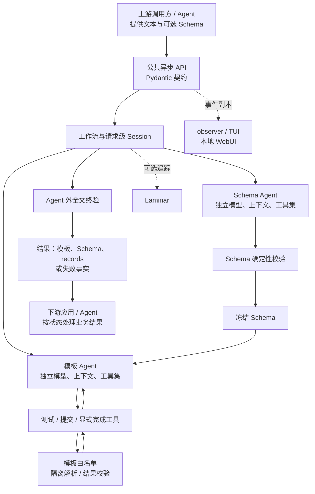
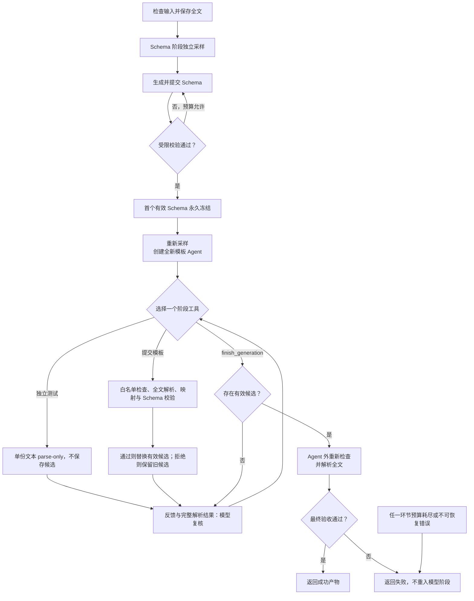

# CLI 输出解析 Agent 设计方案

<!-- markdownlint-disable MD013 -->

本文面向项目汇报，按业务能力、架构协作、生成流程和质量保障说明 CLI 输出解析 Agent 的整体设计。设计以稳定的数据契约连接调用方，以受控的模型生成和确定性验收交付解析产物；精确运行协议、配置和评测规则由专题文档维护。

## 1. 背景与目标

网络设备 CLI 输出包含接口状态、版本、邻居、会话和资源等信息，但不同厂商、命令及输出形态存在差异。表格、键值行、重复段落和折行文本经常同时出现，业务系统难以直接查询、比较和消费。人工编写解析模板还需要同步定义字段、类型和层级，并随样例变化反复验证。

本项目基于 AgentScope 构建生成 Agent：从 **同一命令的 1–5 份已取得的纯文本输出**，生成一份共享的 TTP 模板、描述解析记录的 JSON Schema，以及这些输入的实际解析结果。每份输入必须非空白，UTF-8 编码不超过 `1 MiB`。TTP 指 Template Text Parser；输入中的命令、指令或其他文字均作为待解析数据，不触发设备操作、系统命令或外部访问。

设计目标是让一次请求完成“理解结构—提出方案—验证—修正—交付”的闭环，减少调用方手工协调步骤。“一次请求”允许内部多轮模型调用和模板修正，并不保证首轮成功。交付模板可以供后续解析复用，但对新设备版本、新格式或未见输入的适用性仍需验证。

## 2. 能力与使用方式

三条路径共享框架无关的异步 Python 契约。调用方不需要构造 AgentScope 消息，也不需要从模型文字中提取代码。

| 使用场景 | 公共方法与请求 | 返回内容 |
| --- | --- | --- |
| 自动完成全流程 | `generate(GenerationRequest, *, observer=None)` | `GenerationResult`，成功时包含模板、Schema 和 records |
| 先确认字段设计 | `propose_schema(GenerationRequest, *, observer=None)` | `SchemaProposalResult`，成功时只有冻结的 Schema 提案 |
| 使用既定字段契约 | `generate_from_schema(TemplateRequest, *, observer=None)` | `GenerationResult`，仅运行模板阶段 |

请求中的 `command_outputs` 保存原始输出；`TemplateRequest` 额外携带 `result_schema`。先提案的路径允许调用方审阅、修改 Schema，再发起一次模板请求；这发生在两个公共调用之间，不是在正在运行的阶段内解冻 Schema。外部 Schema 经过与模型提交相同的受限校验后才冻结；受限校验失败返回 `invalid_injected_schema`，不启动模板 Agent。请求数量、空白输入、非 object 根等请求契约错误可在此前由 Pydantic 拒绝。

以下为**虚构的说明性示例**，只展示输入与结果映射，不是实测运行或可执行模板：

```text
Interface  Status
Gi0        up
Gi1        down
```

对应的 `artifact.records` 示意为：

```json
[
  {
    "interfaces": [
      {"name": "Gi0", "status": "up"},
      {"name": "Gi1", "status": "down"}
    ]
  }
]
```

一份完整输入对应一个根 object，因此上例只有一个 record，内部包含两条接口数据。Schema 描述这个根 object，不描述外层 `records` 列表。多份输入使用同一模板，`records[i]` 与 `command_outputs[i]` 一一对应；系统不会把不同输入自动合并成同一个业务对象。

## 3. 总体架构与协作

### 3.1 技术分工与模块边界

系统采用“模型提出和复核候选，确定性代码控制状态并验收”的架构。下图实线表示业务处理关系，虚线表示只读观察；调用方和结果消费方可以是普通 Python 应用或其他 Agent，通过公共契约协作。



| 技术或模块 | 设计职责 |
| --- | --- |
| AgentScope | 提供阶段 Agent、模型调用、对话状态及工具执行机制；依赖范围为 `>=2.0.4,<2.1`，具体版本由依赖锁文件固定 |
| 大模型 | 推断字段与结构、生成声明式模板，并根据工具结果复核语义 |
| TTP | 按模板解析文本，输出可校验的数据结构 |
| JSON Schema | 定义单个 record 的字段、类型、层级和必填约束 |
| Pydantic 2 | 约束公共请求、结果和产物，避免业务契约绑定 Agent 框架 |
| 工作流与 Session | 保存全文、冻结 Schema、候选及预算，协调阶段和最终验收 |

领域契约、采样和验证层不依赖 AgentScope；公共入口负责 API 与根 Trace，私有工作流负责编排。跨阶段业务状态与模型对话分开保存，便于独立测试和替换外围调用方式。

### 3.2 上下游通过业务产物协作

协作链为：**上游提供已取得文本 → 本 Agent 生成并验收标准产物 → 下游消费 records 和 Schema**。上游负责输入来源及同一命令的分组；若下游已有字段要求，可经 `generate_from_schema()` 提供既定契约。需要人工参与时使用“提案—审阅—生成”路径，审阅结果作为新请求输入。

下游应检查返回状态，仅在成功时消费 artifact，并保留输入索引关系。Schema 提案只确认结果结构，不代表模板生成成功。生成失败由外层调用方根据结构化原因决定人工处理或新请求；主动取消传播至外层任务，不转换为成功结果。普通模型文本、观察事件和未完成候选均不作为业务交接产物。

模板复用要求调用方验证新输出的格式适用性和字段契约，避免把样例通过视作通用保证。字段名、层级和类型直接影响消费者；需要调整这些约定时，通过新的 Schema 和请求建立明确边界，不在消费端静默改名或补值。业务协作不共享 AgentState、消息历史或 Laminar Trace，也不允许把观察数据作为下一次生成的隐式输入。

接入以异步 Python API 为基础，传输协议和部署方式由外层系统负责。公共生成用例不承担通用多 Agent 编排、A2A/MCP 适配、消息总线和多用户治理。共享模块的提取以第二个真实用例或消费者为依据；协议适配应保留请求、结果、失败及取消语义，不改变内部阶段与验收规则。

### 3.3 开发界面与观察通道

本地 WebUI 支持启动生成、审阅 Schema、查看历史和取消任务，只绑定回环地址，同一时刻最多运行一次生成。TUI 用于观察或取消整个请求。Laminar 是可选调试与评测通道。这些能力通过公共 API 或观察接口接入，不参与生成决策，也不构成多用户部署平台。

## 4. 核心生成流程与设计依据

### 4.1 一次完整请求



Schema 阶段只注册 `submit_result_schema`。模型可以根据拒绝反馈修改提案，第一个通过校验的 Schema 被深拷贝并冻结。模板阶段重新创建 Agent、模型、AgentState 和 Toolkit，只交接冻结 Schema，并从全文重新采样；此前的对话、失败提案和推理历史不跨阶段复用。

模板阶段提供 `submit_ttp_template`、可选的 `test_ttp_template` 和无参数的 `finish_generation`。独立测试只探索一份文本的解析效果，不执行 Schema 回验，也不保存候选。正式提交才对所有完整输入进行模板、映射及 Schema 检查。

提交和测试先反馈有界校验事实，再给出完整解析结果。正式提交的反馈区分“本次是否通过”和“当前保留哪个有效候选”，并提供基于冻结 Schema 的字段覆盖事实；可选字段缺失仅提示对照原文复核，不证明原文一定存在该字段。测试反馈不提供 Schema 覆盖事实。

每次模型回复要求最多调用一个阶段工具，请求默认省略 `tool_choice` 并固定 `parallel_tool_calls=False`。普通文本不构成产物，零工具回复通过受控提醒重试并计入预算；供应商相关的推理历史与工具选择处理，以[运行协议](agent-architecture-and-runtime.md)限定的适用条件为准，不改变提交校验和阶段隔离。有效提交只建立最新候选；模型复核后必须显式 finish。终验在 Agent 外再次执行，成功才打包产物，终验失败不返回模型继续尝试。

### 4.2 Schema 语义建模

Schema 的根描述整份输出。模型在同一次直接生成中，依次识别业务值、确定实体归属、选择容器、确定字段名称并复核完整性，不增加中间计划产物或确认阶段。

首先区分独立业务值与展示形式。一个属性行可以含版本、日期和计数等多个逻辑值；折行也可能只是在展示一个完整标识。字段设计要依据值的含义和边界，避免机械地把每行变成一个字段，或把多个独立值塞进一个复合字符串。数字和布尔类型只在证据与解析转换充分时使用，不能仅凭外观把标识符转换为数值。

其次确定实体归属和容器。平面属性直接归属根对象；固定角色章节使用 object；按实例标识区分的同类实体和表格使用 array，即使样例只有一个实例。子项和汇总归属真实父对象，不按字段类型或装饰标题额外增加容器。这样既能表达样例，又能避免把单条会话误当成整份输出的根。

命名优先依据可靠英文标签，保留词序、缩写、限定与单复数，再规范为合法 `snake_case`。多行表头只组合相同列的限定；容器名依次参考集合或章节标题、实体标签和业务语义。冲突优先用原文真实限定消歧，无可靠标签、拆分子项或命名合法性例外时才使用语义名称。

提交前逐实体复核业务值、所属关系和必填条件，区分字段缺失、展示为空及字面占位值。命名与结构规则属于模型指导，确定性校验只约束受限 Schema 的合法性。调用方可通过提案审阅明确业务口径；Schema 一经本次请求冻结，模板阶段必须忠实实现该契约。

### 4.3 复杂输出的实体关联

同一份输出的状态表、描述表和端口汇总可能分别描述同一批实体。关联设计以实体身份和归属为基础：例如端口与 ONT 的关系必须区分“同一端口中的 ONT 标识”和“不同端口中相同的 ONT 标识”，不能只凭局部编号或文本出现顺序合并。

结果结构应能表达实体、子项和汇总，并明确重复记录、缺失描述、乱序数据及冲突值的语义。不能默认采用后值覆盖前值，也不能靠丢弃难处理字段消除冲突；原文汇总值应保留，不通过重新计算替换。语义数组与动态键字典的选择需由身份、重复性及消费者契约共同决定，本设计不对具体场景预设唯一结构。

动态路径不能绕过受限 Schema 和模板白名单，不能作为默认可用语法。若关联表达依赖动态键，必须同时约束映射值结构、路径引用、键的解释、层级与结果大小；含点、斜杠、星号或花括号的业务键不得意外改变路径含义。无法在这些约束内忠实表达实体关系时，应作为能力边界处理，不使用宏、动态代码或隐式解析后合并替代。

关联约束须贯通 Schema 提交与注入、模板静态检查、隔离解析、结果回验和反馈。动态键可能携带业务数据，普通诊断只能保留有界事实，不能直接暴露键值。验收需对完整字段和值建立独立预期，同时覆盖正常关联、重号、乱序、缺值、冲突、恶意键和多输入隔离；单项语法可执行不能替代整份输出的完整性验证。

### 4.4 关键选择与代价

| 设计选择 | 解决的问题 | 代价或边界 |
| --- | --- | --- |
| 先定 Schema，再生成模板 | 把字段设计与匹配实现分开，使模板围绕固定目标收敛 | 错误的字段语义也可能被合法冻结，需要新请求或人工审阅修正 |
| 两阶段上下文隔离 | 避免前一阶段的失败尝试干扰模板生成 | 需要重新构造上下文，不能借用前阶段全部推理 |
| 工具承载提交与反馈 | 让产物接受条件由代码统一控制 | 依赖模型正确调用工具，重试消耗时间与轮次 |
| 保留最新有效候选 | 后续无效尝试不会丢失已有可验收方案 | 最新有效不等于内容最优，仍需模型复核 |
| 显式 finish 与独立终验 | 区分“模板可执行”和“生成已完成”，以实际重验结果交付 | 增加模型及解析成本，不能替代业务语义判断 |

## 5. 质量保障与验收

### 5.1 确定性约束与资源控制

Schema 使用受限 Draft 2020-12：根为 object，对象封闭，字段为 ASCII 小写 `snake_case`，最长 120 字符且禁止 Python 保留关键字；嵌套和复杂度受控，不使用引用或组合分支。模板在实例化解析器前接受语法树和白名单检查，只允许受控的声明式标签、模式、过滤器与参数，禁止宏、动态求值和外部数据加载。

解析在独立 spawn 进程及临时缓存目录中完成，并限制时间、模板复杂度和结果大小。每份输入必须恰好得到一个根 object；只允许解包一层“单元素 list 包裹 dict”的 TTP 外壳，真正多根结果会被拒绝。隔离进程用于超时终止和状态隔离，安全边界同时依赖解析前的静态限制。

默认共享预算为 900 秒、13 个模型轮次、9 次模板提交；达到提交上限的那次即使通过校验也会终止为失败，因此必须在触达上限前 finish。两个阶段各有最多 3 次零工具重试，单次隔离解析默认 20 秒。总时长采用协作式取消和有界清理，实际墙钟可能略超预算，不作为严格实时承诺。

协议格式错误、业务校验拒绝和执行异常分别处理，避免把模型没有正确调用工具与模板内容不合格混为一谈。连续工具协议失败最多进行三次受控修复，第四次停止，合法参数调用重置该序列。Schema 回复因输出长度截断时，在框架 JSON 修复及工具执行前丢弃其中的工具调用，防止残缺提案被冻结；流式工具片段需等待结束原因明确后才能释放。

生成失败返回结构化 issues 和元信息，不携带成功 artifact；请求格式、配置异常与主动取消另有异常语义。普通日志和公共诊断只保存有界事实。完整输入、模板和解析值只进入业务成功产物或明确启用的调试、观察与本地存储通道；这些观察内容不回灌模型上下文。

### 5.2 校验能证明什么

**结构合法、内容完整、语义正确是三个不同目标。** Schema 合法只能证明结构符合受限规则；模板结果通过 Schema，仍可能漏掉可选字段、误捕获表头、把状态改为空字符串，或把多个业务值合成一个字段。字段覆盖反馈帮助发现需要复核的位置，无法独立判断原文含义；字符串差异不能通过统一的解析后清洗掩盖。

模型看到的是按阶段采样并适配上下文预算的输入，确定性工具和终验读取完整输入。历史工具结果折叠及 AgentScope 原生压缩用于控制上下文增长，不能保证摘要后仍保留全部输入和冻结 Schema。全文解析成功也不能证明模型理解了未看到的内容；大输出和复杂语义仍是质量风险。

### 5.3 内容保真与质量目标

字段复核以原文业务事实为依据。可选字段允许缺失，不意味着原文中存在的状态或占位值可以省略；空槽、缺键和字面空字符串需按字段语义区分。表格需对照列映射与数据行数检查，防止表头、分隔线或固定标签被误捕获为业务值。

字符串拼接区分三种情况：同一 token 的视觉折行使用空分隔符；纵向多值列举使用单个空格；有行界语义的自由文本保留换行。词项内部的空格与符号原样保留。这些约定由模型在模板生成与结果复核中执行，严格评分不会为拼接错误放宽要求。

| 质量目标 | 验证方法 | 关键场景与判定边界 |
| --- | --- | --- |
| Schema 语义与命名一致 | 对同一输入多次独立生成，分别审阅规则遵循、业务合理性和命名／层级一致性 | 固定角色、重复实体、父子归属、逻辑值拆分与标签限定；相同错误不算业务正确 |
| 字段完整与取值保真 | 从原文人工核对预期，在固定 Schema 下严格比较 records，并结合完整流程审阅 | 空槽、缺失、占位符、折行、单行与多行；Schema 合法不替代内容正确 |
| 复杂实体关联 | 合成边界样例与真实输出全文验证，检查完整结构和值 | 乱序、缺描述、重号、重复与冲突键、汇总及多输入隔离 |
| 生成稳定性与资源效率 | 固定模型、提示、输入和预算重复运行，分别统计通过、轮次、耗时与失败原因 | 截断、零工具回复、协议错误、候选未 finish 和预算终止；高预算诊断单独报告 |
| 上下游契约一致 | 从输入分组到下游消费做端到端验证 | 索引映射、外部 Schema 拒绝、生成失败及取消传播，观察数据不参与业务决策 |

### 5.4 分层评测

| 验证方式 | 能提供的证据 | 不能替代的证据 |
| --- | --- | --- |
| 离线 preflight / baseline | 人工测试资产合法，标准模板与标准答案一致 | Agent 自动生成正确率 |
| Schema-only | 字段命名、结构一致性及人工语义审阅 | 模板可执行性和最终 records 准确率 |
| TTP-only | 固定标准 Schema 下的生成流程及 records 严格一致性 | Schema 自动推断质量和完整两阶段效果 |
| End-to-end | 调用 `generate()`，结合受限 Schema 与解析审阅计算联合通过 | 自动证明所有业务事实、未覆盖格式及长期稳定性 |

标准答案必须从原始文本独立人工核对，不使用被测产物或 Trace 生成。固定标准 Schema 下的严格 records 评分忽略对象键顺序，但区分数组顺序、类型、缺失、空字符串和 `null`。自动生成 Schema 的端到端结果需按受限审阅规则判断，不能仅因字段名称不同就套用固定 Schema 的严格全等分数；联合通过要求各项必要证据齐全，未知和未完成审阅不算通过。

回归采用统一入口和明确输入范围，区分离线资产闭环与模型质量。比较效果时记录模型、提示版本、输入范围、预算和重复次数，并预先确定验收条件，避免不同条件下的结果直接相加。资产变动后验证默认及 full-scope 范围；涉及生成策略的调整同时关注质量、失败分布与资源消耗，不能仅凭首次提交更快或结构复验通过宣称语义改善。

## 6. 参考资料

- [架构与公共契约](architecture.md)：公共契约、模块职责与确定性约束。
- [Agent 架构与运行流程](agent-architecture-and-runtime.md)：阶段协议、采样、预算和反馈细节。
- [Schema 命名与结构政策](schema-policy-v48-protocol.md)：业务值、实体归属、容器与命名规则。
- [Agent 评测边界](agent-evaluation.md)：指标含义、标准答案、语义审阅和脱敏规则。
- [测试集说明](../evals/standard-test-dataset.md)与[标准测试集运行计划](live-corpus-test-plan.md)：资产格式、范围和验收入口。
- [复杂输出关联专题](ROADMAP.md)：实体合并、受限路径及验收条件。
- [公共入口源码](../src/cli_parser_agent/ttp_generation/generator.py)、[领域契约](../src/cli_parser_agent/ttp_generation/contracts.py)与[Schema 校验器](../src/cli_parser_agent/ttp_generation/validation/json_schema.py)：接口与确定性约束的源码依据。
